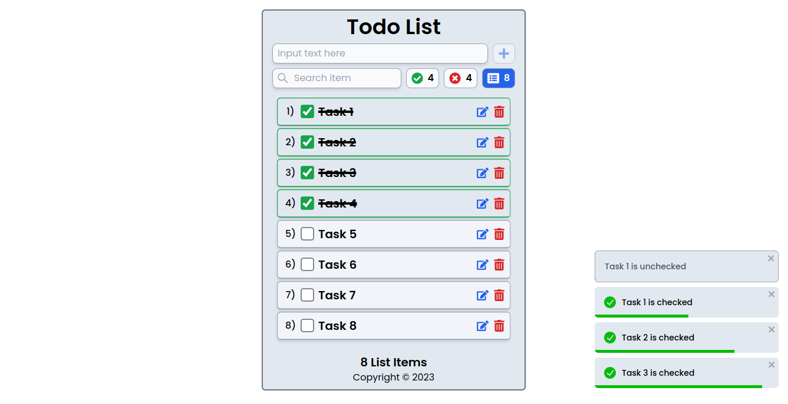

# Todo List

This is a simple Todo List application built with React.js and Tailwind CSS.

##### [Live Demo](https://todolist-first.netlify.app/)


<p align="center">
  <a src="https://todolist-first.netlify.app/" target="_blank"></a>
</p>

## Features

- Add new tasks to the list
- Mark tasks as complete
- Delete tasks from the list
- Integrate with API 

## Technologies Used

- React.js
- React icons
- React toastify
- Tailwind CSS


## Installation

1. Clone the repository:

   ```bash
   git clone https://github.com/hudamnhd/todo-list-2.git

2. Navigate to the project directory:

   ```bash
   cd todo-list-2
   
3. Install the dependencies:

   ```bash
   npm install

## Usage

1. Start the development server:

   ```bash
   npm run start
